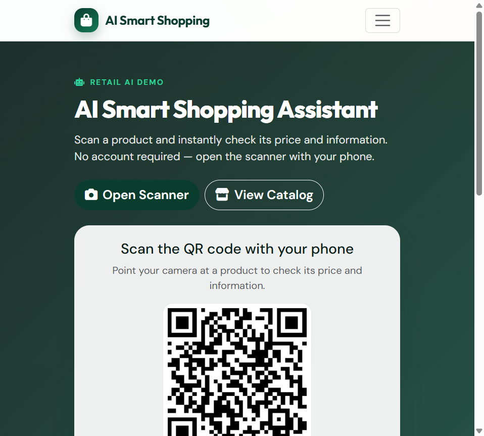
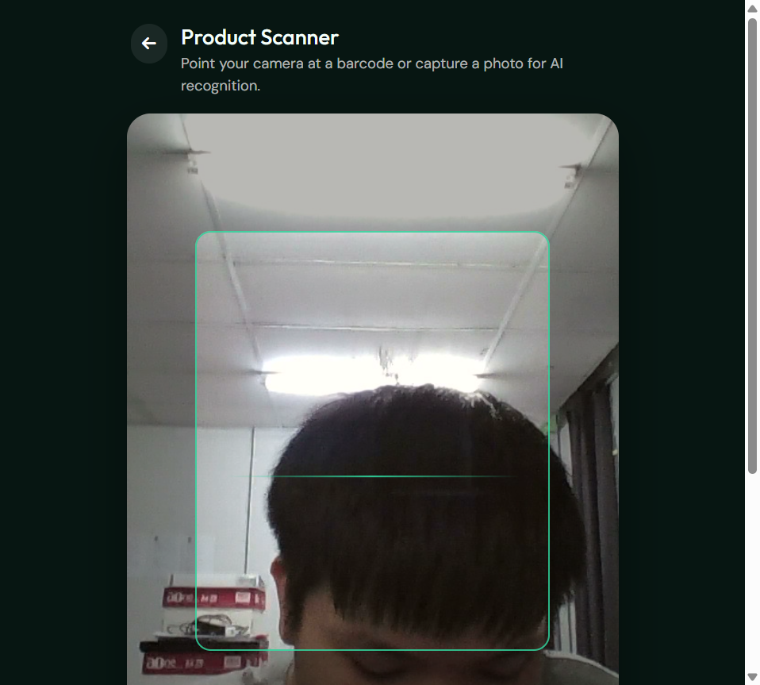
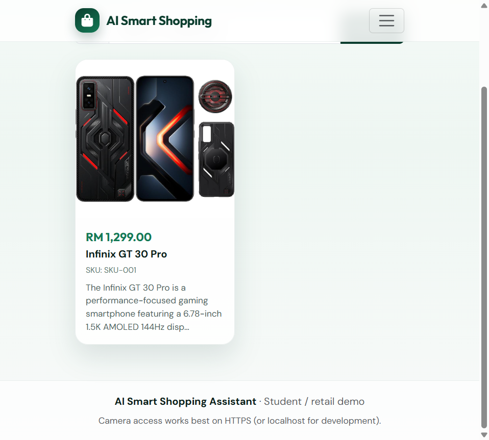
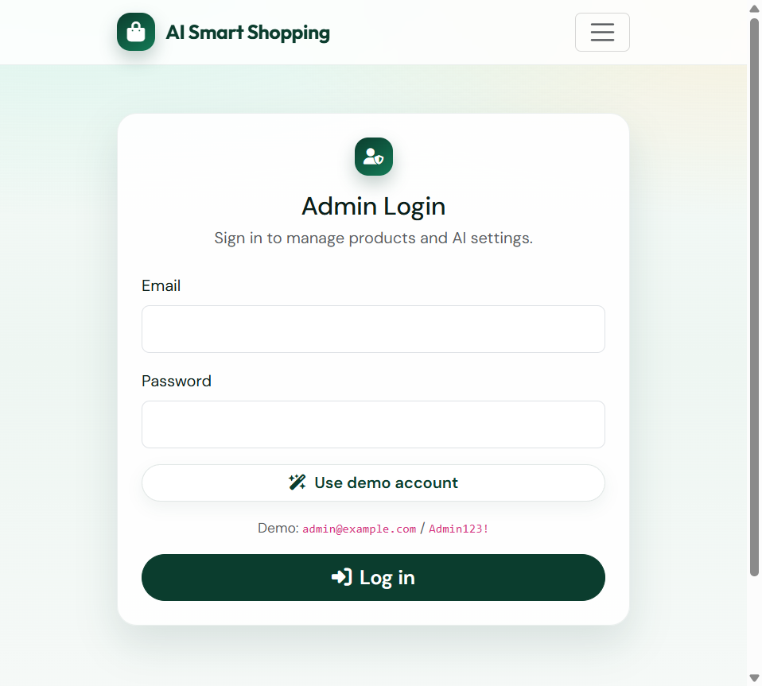
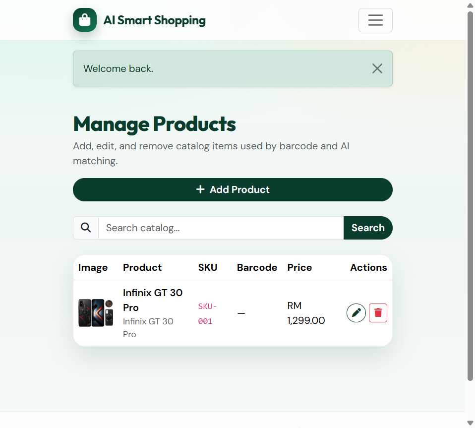
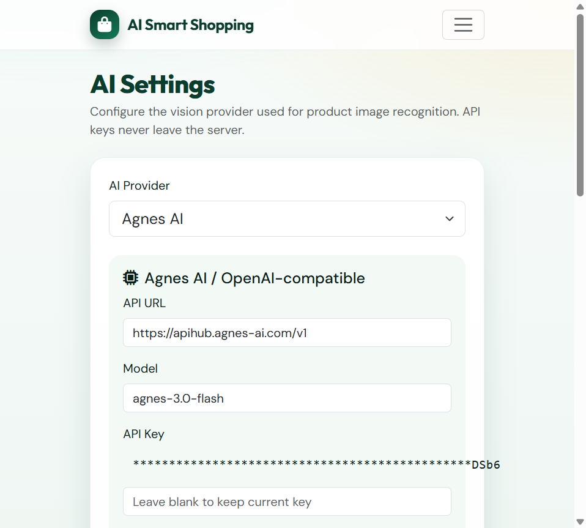

# AI Smart Shopping Assistant

Customer barcode + AI vision shopping assistant for retail demos.

Scan a product with your phone camera to check the official store price and product info. No customer account required.

Administrators manage the product catalog and AI providers (Agnes AI / Google Gemini) from a secure admin panel.

---

## Quick start (XAMPP)

1. Put the project in `C:\xampp\htdocs\ai_shopping_assistant`
2. Copy config example:
   ```text
   copy includes\config.example.php includes\config.php
   ```
3. Edit `includes/config.php` if needed (typical XAMPP: `root` + your MySQL password)
4. Start **Apache** + **MySQL** in XAMPP
5. Open: http://localhost/ai_shopping_assistant/install.php
6. Run installation, then login:
   - Email: `admin@example.com`
   - Password: `Admin123!`
7. Add your products in **Manage Products**
8. Configure AI keys in **AI Settings**
9. Open the homepage QR / **Scanner** on your phone

Forgot admin password after install: re-run a local password reset via SQL, or temporarily use `fix_admin.php` (delete it after use - it is gitignored).

---

## Features

- Homepage QR code to mobile scanner (no customer signup)
- Live camera preview with rear / front switch
- Barcode recognition (ZXing): EAN / UPC / Code 128 / Code 39 and more
- AI image recognition via server-side Agnes AI or Google Gemini
- Catalog matching: SKU, name, detection keywords, normalized text
- **Prices always come from MySQL** (never from the AI)
- Admin product CRUD + secure image upload
- AI settings with fallback models + separate connection tests
- Installer for XAMPP / cPanel-style PHP hosting
- Responsive Bootstrap 5 UI

---

## Screenshots

| Home + QR | Scanner |
|:---:|:---:|
|  |  |

| Product catalog | Admin login |
|:---:|:---:|
|  |  |

| Manage products | AI settings |
|:---:|:---:|
|  |  |

Tip: replace any screenshot in `docs/screenshots/` anytime; keep the same file names.

---

## Folder structure

```text
ai_shopping_assistant/
├── admin/                 Manage products + AI settings
├── api/                   barcode.php + recognize.php
├── assets/                CSS, JS, vendor (ZXing, QRCode)
├── docs/screenshots/      README images
├── includes/              Config, auth, AI, helpers (web-blocked)
├── sql/schema.sql         MySQL tables
├── uploads/products/      Product images
├── uploads/cache/         Temporary AI captures (deleted after use)
├── install.php            Web installer
├── index.php              Homepage + QR
├── scan.php               Customer scanner
├── products.php           Public catalog
├── login.php / logout.php
└── LICENSE
```

---

## 1. XAMPP setup

1. Copy this folder to `C:\xampp\htdocs\ai_shopping_assistant`
2. Start Apache + MySQL
3. Create local config:
   ```text
   copy includes\config.example.php includes\config.php
   ```
4. Set DB values in `includes/config.php`:
   - Host: `127.0.0.1` or `localhost`
   - Database: `ai_shopping_assistant`
   - User: `root`
   - Password: your local MySQL password
5. Open http://localhost/ai_shopping_assistant/install.php
6. Run installation
7. Login at http://localhost/ai_shopping_assistant/login.php
   (or click **Use demo account**)

Manual alternative:

1. Import `sql/schema.sql` in phpMyAdmin
2. Create `includes/config.php` from the example
3. Create admin user / run `install.php` for the easiest path

---

## 2. Customer flow

```text
Scan QR on homepage
        |
Open scan.php on phone
        |
Allow camera
        |
Barcode found? -> lookup MySQL -> show product
        |
        no
        |
Capture photo -> PHP -> AI provider -> match catalog -> show MySQL price
```

Scanner controls:

- **Capture** - AI image recognition
- **Retake** - restart camera
- **Switch** - front / rear camera

---

## 3. Admin product management

In **Manage Products**:

- Add SKU, barcode, name, detection keywords, price, description, image
- Edit / delete with confirmation
- Search catalog

Public catalog: http://localhost/ai_shopping_assistant/products.php

---

## 4. AI configuration

1. Login -> **AI Settings**
2. Choose provider: **Agnes AI** or **Gemini**
3. Set API URL, model, fallback models, API key
4. Click **Test Agnes AI** / **Test Google Gemini** / **Test Both**

Architecture:

```text
Browser -> PHP API -> AI Provider -> PHP catalog match -> Browser
```

API keys never leave the server. Saved keys are shown masked.

Suggested newer models:

- Agnes: `agnes-3.0-flash` (fallback: `agnes-2.5-flash`, `agnes-2.0-flash`)
- Gemini: `gemini-3.8-flash` (fallback: `gemini-3.7-flash`, `gemini-3.6-flash`, `gemini-3.5-flash`)
- Agnes URL: `https://apihub.agnes-ai.com/v1`

---

## 5. Camera / HTTPS notes

- Production camera access needs **HTTPS**
- `http://localhost` / `http://127.0.0.1` usually work without HTTPS
- For phone testing from another device, use a tunnel (for example Cloudflare Tunnel) so the phone gets HTTPS

---

## 6. cPanel deployment (optional)

1. Upload project (do **not** upload your local secrets - see `.gitignore`)
2. Create MySQL database + user in cPanel
3. Create `includes/config.php` from `includes/config.example.php`
4. Fill cPanel DB host / name / user / password
   (copy names exactly - some cPanel DB names contain spaces)
5. Open `https://your-domain.com/ai_shopping_assistant/install.php`
6. Run installation -> configure AI keys -> add products
7. Delete `install.php` / repair scripts after setup

---

## Requirements

- PHP 8.2+ / 8.3+ with `pdo_mysql`, `curl`, `gd`, `mbstring`, `fileinfo`, `json`
- MySQL / MariaDB
- Apache (`.htaccess` recommended)
- Browser with camera support for scanning

---

## Default admin (local demo)

| Field | Value |
|-------|-------|
| Email | `admin@example.com` |
| Password | `Admin123!` |

Change this password after first login on any shared / production host.

---

## Privacy and gitignore

These local/private files are ignored by git (see `.gitignore`):

- `includes/config.php` - DB password and local settings
- `includes/installed.lock`
- `uploads/products/*` and `uploads/cache/*` (except protectors)
- one-time scripts like `db_check.php`, `fix_admin.php`
- `.env`, keys, editor junk

Use the public template instead:

```text
includes/config.example.php
```

Never commit real API keys or production DB passwords.

---

## Troubleshooting

| Issue | Check |
|-------|--------|
| Redirected to installer | Run `install.php`; ensure MySQL is running |
| DB access denied | Credentials in `includes/config.php`; user privileges |
| Camera black / blocked | Permission, HTTPS, or restart with **Retake** |
| Barcode not found | Product barcode missing in catalog - use **Capture** |
| AI failed | API URL / key / model; cURL enabled; test buttons in AI Settings |
| Image upload failed | GD + fileinfo enabled; `uploads/products` writable |

To reinstall locally: delete `includes/installed.lock`, drop/recreate the database, then open `install.php` again.

---

## License

This project is licensed under the [MIT License](LICENSE).
